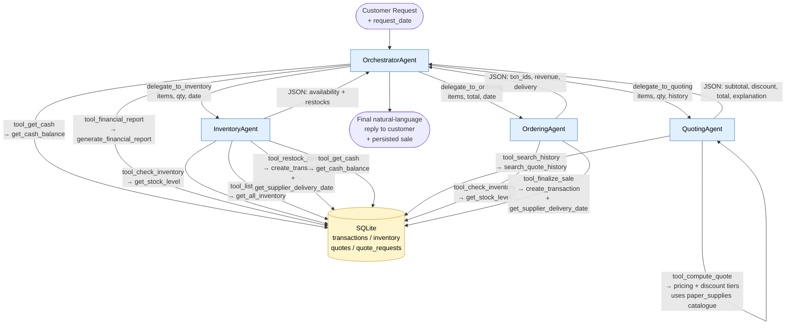
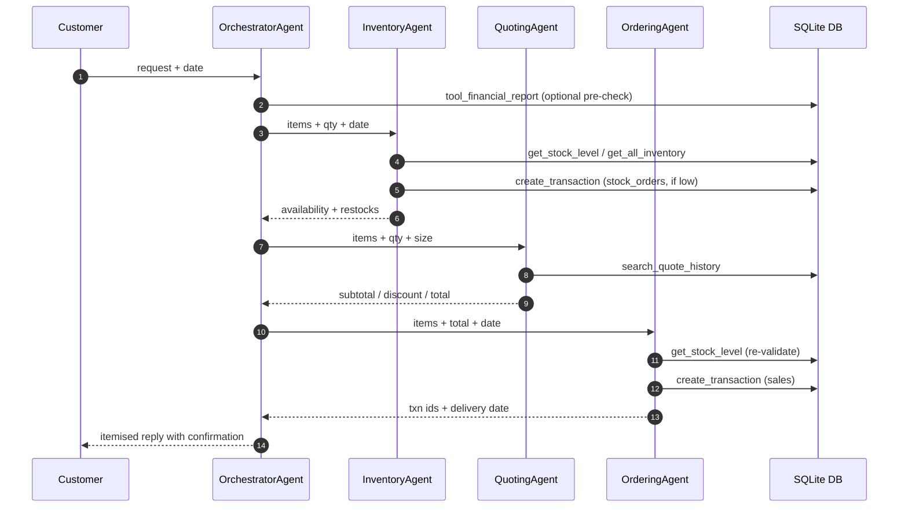

# Workflow Diagram

The diagram below shows the four agents, the tools each agent owns, and the
underlying helper function (from `project_starter.py`) that every tool wraps.
Each tool node is labelled `tool_xxx → helper_fn()` so the mapping between an
agent-callable tool and the business-logic primitive it executes is explicit.

## Tool ↔ helper function ↔ purpose

| Agent             | Tool                     | Helper function(s) wrapped                           | Purpose                                                                       |
|-------------------|--------------------------|------------------------------------------------------|-------------------------------------------------------------------------------|
| OrchestratorAgent | `tool_get_cash`          | `get_cash_balance`                                   | Read available cash before agreeing to large quotes / restocks.               |
| OrchestratorAgent | `tool_financial_report`  | `generate_financial_report`                          | Snapshot cash + inventory valuation + top sellers as of the request date.     |
| OrchestratorAgent | `delegate_to_inventory`  | `Agent.run_sync` on `InventoryAgent`                 | Hand a sub-task to the InventoryAgent (text-in / JSON-out).                   |
| OrchestratorAgent | `delegate_to_quoting`    | `Agent.run_sync` on `QuotingAgent`                   | Hand a sub-task to the QuotingAgent.                                          |
| OrchestratorAgent | `delegate_to_ordering`   | `Agent.run_sync` on `OrderingAgent`                  | Hand a sub-task to the OrderingAgent.                                         |
| InventoryAgent    | `tool_check_inventory`   | `get_stock_level` (+ `inventory` table lookup)       | Resolve item name and report current stock vs. minimum stock level.           |
| InventoryAgent    | `tool_list_inventory`    | `get_all_inventory`                                  | Bulk inventory snapshot when the agent needs the catalogue.                   |
| InventoryAgent    | `tool_restock_item`      | `create_transaction` + `get_supplier_delivery_date` + `get_cash_balance` | Place a `stock_orders` transaction (cash-bounded) with realistic delivery date. |
| InventoryAgent    | `tool_get_cash`          | `get_cash_balance`                                   | Decide whether a restock can be afforded.                                     |
| QuotingAgent      | `tool_search_history`    | `search_quote_history`                               | Pull historical quotes for similar requests to inform pricing.                |
| QuotingAgent      | `tool_compute_quote`     | `paper_supplies` price catalogue + tier rules        | Authoritative subtotal, discount %, and total computation.                    |
| OrderingAgent     | `tool_check_inventory`   | `get_stock_level`                                    | Re-validate stock just before committing the sale.                            |
| OrderingAgent     | `tool_finalize_sale`     | `create_transaction` + `get_supplier_delivery_date`  | Write per-line `sales` transactions and return delivery date.                 |

> The seven required helper functions called out by the rubric
> (`create_transaction`, `get_all_inventory`, `get_stock_level`,
> `get_supplier_delivery_date`, `get_cash_balance`, `generate_financial_report`,
> `search_quote_history`) are all reached through one of the tools above.

## Sequence per request

## Discount tiers

| Order size                                   | Discount |
|----------------------------------------------|----------|
| ≥1000 units, or `order_size == large`        | **10%**  |
| ≥250 units, or `order_size == medium`        | **5%**   |
| otherwise                                    | 0%       |
