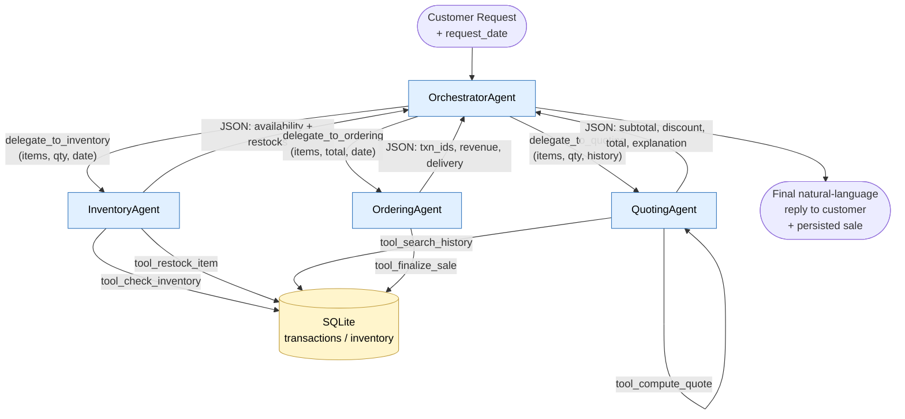
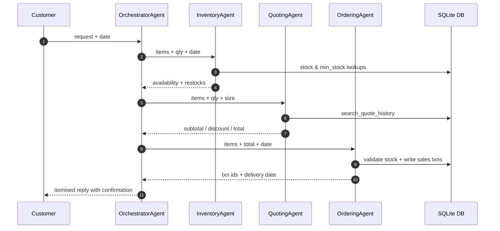

# Workflow Diagram

## Sequence per request

## Discount tiers

| Order size                                   | Discount |
|----------------------------------------------|----------|
| ≥1000 units, or `order_size == large`        | **10%**  |
| ≥250 units, or `order_size == medium`        | **5%**   |
| otherwise                                    | 0%       |
